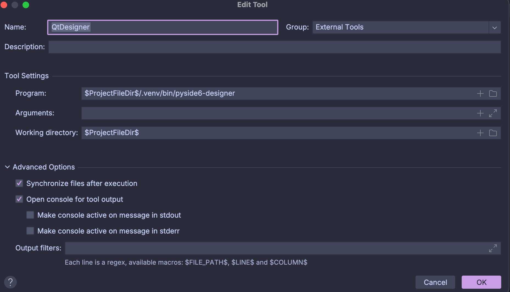
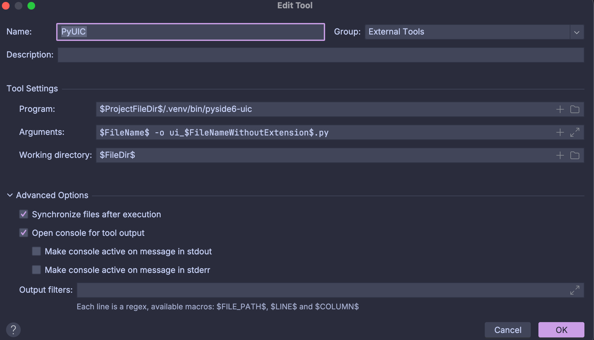

# Qt
This is a repository to experiment with python & qt with the QT-Designer.

It also provides the source code of the [HRW-Monsters](hrw-monsters/main.py) card game.

## Table of Contents
- [Tech Stack](#tech-stack)
- [Setup](#setup)
    - [External Tools](#external-tools) 
    - [Autocompiling](#autocompiling)
- [Authors](#authors)

## Tech Stack
- Python 3.13
- Qt-Version: 6.10
- Pyside6
- IDE: PyCharm
- GUI-Designer: Qt Designer

## Setup
You will first need to install the `Pyside6` packages with the following commands:

```bash
  pip install pyside6
```

### External Tools
After that add the external tools:
- QT-Designer
- PyUIC

To add the external tools enter the `PyCharm Settings > Tools > external Tools` and click on the `+` symbol 

For the QT-Designer: write the following into the correct input fields:


And last but not least for the PyUIC:


### Autocompiling
To start the autocompiling, go into your terminal go to the repository folder and type:

```bash
  sh autocompile.sh
```

After that the autocompiler is running in background and will automatically compile any `*.ui` file and place it in the same folder as the `*.ui` file itself.

## Authors
Lennart Novak (LennZone)
